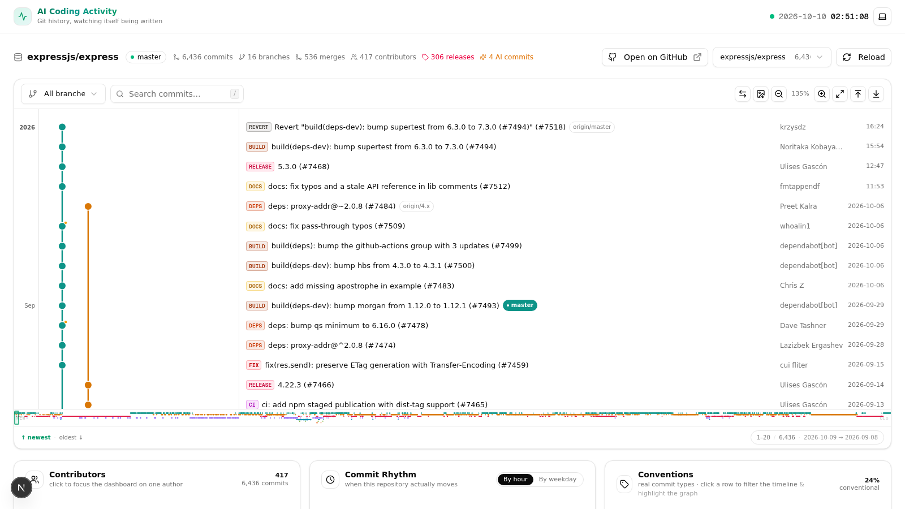
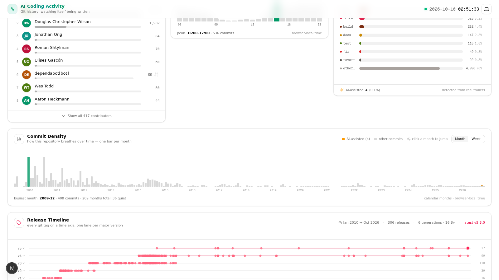
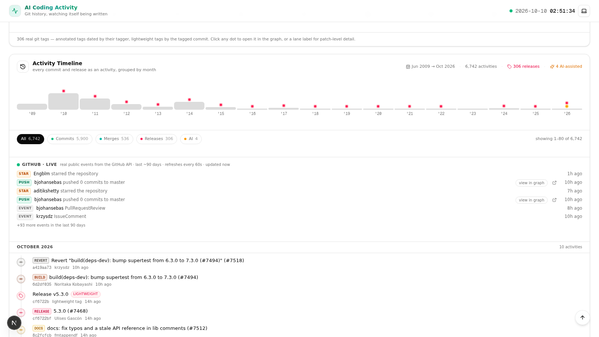
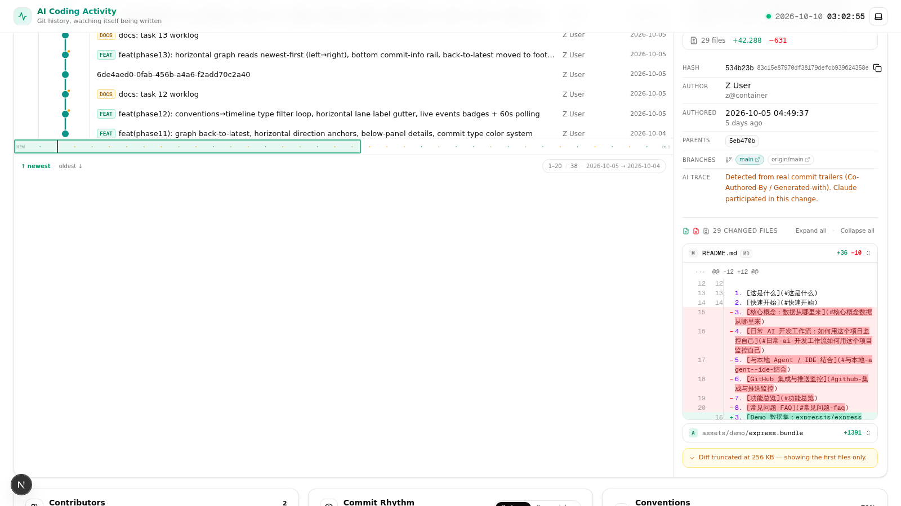
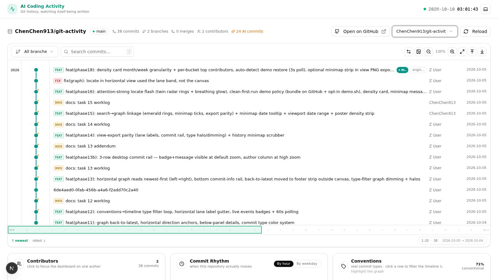

# AI Coding Activity

> 把真实的 Git 历史变成一部「人与 AI 如何协作写代码」的活动的可视化纪录片。
>
> **Git 是唯一真实数据源：不伪造数据、不隐藏/截断/抽样 commit，所有 commit 都可访问。**

[](https://claude.com/claude-code) [](https://nextjs.org)

**[简体中文](README.md) | [English](README_EN.md)**

---

## 目录

1. [这是什么](#这是什么)
2. [截图](#截图)
3. [快速开始](#快速开始)
4. [Demo 数据集：expressjs/express（可选）](#demo-数据集expressjsexpress可选)
5. [核心概念：数据从哪里来](#核心概念数据从哪里来)
6. [日常 AI 开发工作流：如何用这个项目监控自己](#日常-ai-开发工作流如何用这个项目监控自己)
7. [与本地 Agent / IDE 结合](#与本地-agent--ide-结合)
8. [GitHub 集成与推送监控](#github-集成与推送监控)
9. [功能总览](#功能总览)
10. [常见问题 FAQ](#常见问题-faq)

---

## 这是什么

一个零数据库、纯读取 Git 仓库的**本地可视化仪表盘**：

- **Commit Graph（空间视角）**——自研 SVG 轨道布局渲染全量 commit 图，支持缩放/平移/搜索/键盘导航，可**横版/竖版切换**，可**导出超清 PNG**（当前视图 2×/3×/4× 或全历史海报）。
- **Activity Timeline（时间视角）**——所有 commit 与 release 按月分组的活动流，真实计数、窗口化渲染（双向可达，永不隐藏数据）。
- **Release Timeline（发布视角）**——每个真实 git tag 一颗点，按大版本分泳道，展开看 patch 级明细。
- **AI 识别**——通过 commit message 中的 `Co-Authored-By` 等真实痕迹识别 Claude / Cursor / Copilot / Gemini / Codex / Aider 等 AI 协作者。**绝不猜测**：没有痕迹就不标记。
- **Commit Detail**——numstat 文件统计、unified diff、**语法高亮 + 行内 word-level 变更高亮**、GitHub 深链。
- **Live Events**——GitHub 公共事件流（需要 token 解除限流，见下文）。

## 截图

主仪表盘——expressjs/express 的 commit 图（6,436 个 commit 全量渲染，琥珀色圆点标记 AI 参与的提交）：



仓库洞察卡片——Top 贡献者、按时段分布的提交节奏、提交类型规范、逐月提交密度、发布时间线泳道：



活动时间线 + GitHub 实时事件流：



Commit 详情面板——文件变更统计 + 按需展开的 unified diff（语法高亮 + 行内变更标记）：



工具看着自己——本项目自身的历史，38 个 commit 中有 24 个由 AI 协助完成（琥珀色标记）：



## 快速开始

```bash
git clone https://github.com/ChenChen913/git-activity.git
cd git-activity
bun install        # 或 npm install
bun run dev        # 或 npm run dev
# 打开 http://localhost:3000
```

不需要配置数据库——第一版完全从 Git 读取。

**首次运行是干净的**：`repos/` 整个目录被 gitignore，克隆下来不包含任何演示数据。页面会自动回退到 `self`（本项目自己的真实历史），并展示引导卡片告诉你如何注册自己的仓库。想要 6,430 个 commit 的 express 演示数据集？见下一节。

## Demo 数据集：expressjs/express（可选）

演示数据不在仓库的工作区里，但它的**完整快照以 git bundle 随仓库分发**（`assets/demo/express.bundle`，约 10MB）——离线可恢复、跨重启可复现，这就是同步到 GitHub 的演示数据本体：

```bash
bash scripts/demo.sh status    # 查看当前状态
bash scripts/demo.sh restore   # 从离线 bundle 恢复 repos/demo（零网络也能跑）
bash scripts/demo.sh remove    # 删除演示数据，回到干净空间
```

- **本地部署不受虚拟数据影响**：`restore` 是显式的 opt-in，不 restore 就是干净的；`remove` 一键回到空状态。
- 恢复后 origin 会自动指回 `github.com/expressjs/express`，Open on GitHub / Live Events / Releases 全部正常工作。
- `bash scripts/demo.sh bundle` 供维护者从当前 repos/demo 刷新快照。

## 核心概念：数据从哪里来

### 仓库注册表（`src/lib/git/repos.ts`）

所有数据源都注册在这里。内置两个：

| id | 名称 | 说明 |
|---|---|---|
| `demo` | express | `repos/demo` 下的 expressjs/express 全量克隆（6,000+ commits、真实 merge 历史） |
| `self` | git-activity | 本项目自身——「工具看着自己被 AI 造出来」 |

**把你自己的仓库加入监控只需 30 秒**——编辑 `getRegistry()`：

```ts
{
  id: 'my-app',                    // URL ?repo=my-app
  name: 'my-app',
  path: '/absolute/path/to/my-app',// 任意本地 git 仓库
  description: '我的日常开发仓库',
},
```

保存后刷新页面，顶部的仓库切换栏里就会出现你的仓库。**不需要重启服务**（API 每次请求都读注册表）。

> 提示：也可以用 `git clone` 把要监控的远程仓库放进 `repos/` 目录（`repos/` 已被 gitignore，不会被提交）。

### 数据获取方式

- 后端用 `git log --format` / `git for-each-ref` / `git diff --numstat` 等 CLI 命令（Node.js runtime，`execFile`，无 shell 注入面）。
- API 路由统一在 `/api/git/*`，用 `?repo=<id>` 切换仓库。
- 一切计数都是真实值：6,430 commits 就渲染 6,430 个节点（图内做视口裁剪渲染，但数据完整、可导航到每一个）。

## 日常 AI 开发工作流：如何用这个项目监控自己

这是本项目的设计核心场景。假设你每天用 Claude Code / Cursor / Copilot 写代码：

### 第 1 步：让你的 AI 痕迹真实可追溯

大多数 AI 工具会自动在 commit message 里留下 trailer：

```
Co-Authored-By: Claude <noreply@anthropic.com>
```

- **Claude Code**：自动添加（本仓库的每个 commit 都有）
- **Cursor / Copilot / Aider**：默认或可配置添加
- **手动补一条**（适用于任何 Agent）：

```bash
git commit -m "feat: add login" -m "Co-Authored-By: Claude <noreply@anthropic.com>"
```

工具支持识别的痕迹（`src/lib/git/ai.ts`）：`Generated with [Claude Code]`、`Co-Authored-By: Claude/Cursor/Copilot/Gemini/Codex/Aider` 及各家 noreply 邮箱。

### 第 2 步：把你的开发仓库注册进来

见上一节。推荐同时监控多个：你的主项目 + 一个你让 AI 全权维护的仓库。

### 第 3 步：日常怎么"看"

| 你想知道 | 去哪里看 |
|---|---|
| AI 参与了多少 commit？ | 顶部统计条「N AI commits」+ Timeline 的 AI 过滤 chip |
| 哪些 commit 是 AI 写的？ | Graph 中节点右上角的**琥珀色小点**；Timeline 中琥珀色 ✦ 标记 |
| AI 改了什么？ | 点任意节点 → 详情面板看 diff（带语法高亮和行内变更标记） |
| 某个功能是什么时候引入的？ | 用搜索框搜 message → 点击 → 图自动居中选中 |
| 发布节奏健康吗？ | Release Timeline 的泳道密度 + 展开看 patch 明细 |
| 最近的推送/PR/release？ | Live Events 卡（配置 token 后点亮） |

### 第 4 步：git push 之后

推送后（且配置了 `GITHUB_TOKEN`）：

- **Live Events** 会显示真实的 PushEvent / PullRequestEvent / ReleaseEvent / WatchEvent。
- 详情面板里的 GitHub 深链（commit / tree / 作者 / tag）可以直接跳转。
- 本仓库（`self`）自己就是活例子：它有 GitHub remote，推送后它的事件流会显示「自己被推送」。

## 与本地 Agent / IDE 结合

### 已实现

- **任意本地仓库即插即看**——注册表指向仓库路径，不需要构建步骤、不需要数据库。
- **零配置热更新**——你在 IDE 里 commit，刷新页面立即出现（API 实时读 git，无缓存层失真；事件流有 60s 缓存）。
- **AI trailer 协议**——任何遵守 `Co-Authored-By` 惯例的 Agent（Claude Code、Cursor、Copilot、Aider…）都会被自动识别。
- **可脚本化的 QA**——开发期间的自动化浏览器回归直接用 `agent-browser` CLI 完成（完整记录见 `worklog.md`），仓库里不残留一次性脚本。

### 推荐玩法（想法）

1. **开发时挂在副屏**：`bun run dev` 常驻，每次 commit 后瞄一眼 Graph——AI 的 commit（琥珀点）和你的 commit 的比例、分布一目了然。
2. **post-commit hook 自动刷新**（一行脚本）：
   ```bash
   # .git/hooks/post-commit （给被监控仓库装）
   # 用 curl ping 本项目的 API 让缓存失效，或干脆用浏览器刷新
   ```
3. **让 Agent 自己汇报**：在你的 CLAUDE.md / AGENTS.md 里写上「commit 时保留 Co-Authored-By trailer」——本项目的 self 仓库就是这么做的，叙事闭环。
4. **周报素材**：导出全历史海报 PNG（Graph 工具栏 → Export PNG → Full history poster），或截当前视图 3× 超清图放进周报。

### 尚未实现（欢迎 PR）

- 仓库注册的 Web UI（目前改 `repos.ts`）
- WebSocket 实时推送（commit 后自动刷新，无需手动）
- 多仓库对比视图 / AI 参与率趋势图
- CI/CD pipeline 活动类型（结构已就绪，等待数据源）

## GitHub 集成与推送监控

### remote 解析

后端自动从 `git remote get-url origin` 解析 owner/repo。有了 GitHub remote 之后自动启用：

- 顶部「Open on GitHub」按钮
- 每个 commit 的深链
- Releases 统计与 Release Timeline
- Live Events（推荐配置 token）

### 配置 GITHUB_TOKEN（强烈推荐）

GitHub 匿名 API 限流 60 次/小时（且共享 IP 时经常触发）。配置 token 后提升到 **5,000 次/小时**：

```bash
cp .env.example .env.local
# 编辑 .env.local：
# GITHUB_TOKEN=ghp_xxxxxxxxxxxx
```

- `.env.local` 已被 gitignore，**永远不会被提交**。
- token 只在服务端（API route）使用，不会暴露给浏览器。
- Next.js dev 模式会自动热加载 `.env.local` 的修改。

### 推送到 GitHub

```bash
git remote add origin https://github.com/<user>/<repo>.git
git push -u origin main
```

推送完成后刷新页面——Live Events 卡会开始显示真实事件流。

## 功能总览

- ✅ 全量 commit 图（自研轨道布局、zoom/pan、搜索、键盘导航、**横竖切换**、横向底部 commit 信息栏）
- ✅ PNG 导出（当前视图 2×/3×/4×、**全历史海报 + commit 密度条**、亮暗主题自适应、所见即所得）
- ✅ **全历史 Minimap 导航条**（每个 commit 一个点、诚实无抽样；hover 显示日期/message；shift+click 精确定位）
- ✅ **搜索 / 类型筛选全链路联动**（图节点 ring/halo/降饱和 ↔ minimap 标记 ↔ 导出同步，四处视觉同源）
- ✅ **Commit Density 卡片**（逐月密度直方图、AI 分层堆叠、点击月份跳转图）
- ✅ **定位闪烁**（GitHub 事件 / 搜索 / 时间线点击 → 节点雷达双环 + 呼吸光晕，一眼锁定目标）
- ✅ Activity Timeline（月分组、类型/AI/年份过滤、窗口化渲染、GitHub live 事件流）
- ✅ Release Timeline（tag 泳道、patch 级明细、 annotated/lightweight 区分）
- ✅ Commit Detail（numstat、diff **语法高亮**、**word-level 行内高亮**、深链）
- ✅ AI 协作识别（真实 trailer，绝不猜测）
- ✅ Live Events（token 解除限流）
- ✅ 亮/暗主题、移动端全屏 Sheet、390px 零溢出

## 常见问题 FAQ

**Q：本地部署会被演示数据污染吗？**
不会。`repos/` 被 gitignore，克隆仓库不会带任何演示数据；express 快照（`assets/demo/express.bundle`）只是一份静态文件，不 `bash scripts/demo.sh restore` 就永远不会被读进应用。

**Q：会修改我的仓库吗？**
不会。全部是只读 git 命令（log / show / diff / for-each-ref），连 `git status` 级别的写操作都没有。

**Q：图里只看到一部分节点，是不是截断了？**
没有。那是**视口裁剪**（只渲染屏幕附近的节点以保证流畅），用滚轮/拖拽可以到达全部 6,430+ commit；右下角的 `1–80 / 6,430` 是当前可见范围。导出海报时是**全量**渲染。

**Q：为什么有的 commit 没有标 AI？**
因为它的 message 里没有真实 AI 痕迹。这是红线：**不猜测**。系统自动 commit（如 cron）没有 trailer，就不标。

**Q：时间线「showing 1–80 of 6,735」是什么？**
渲染分页（Load more 逐步展开；超过 640 行后变成滑动窗口，顶部可 Load earlier 回看）。所有活动双向可达，计数诚实。

**Q：支持 Windows 吗？**
开发环境基于 Unix 路径（`process.cwd()` 拼接），Windows 下建议 WSL。

---

<div align="center">

**AI Coding Activity** — git is the single source of truth.

</div>
